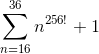
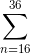

# The [Degree of Difficulty](https://en.wikipedia.org/wiki/Cryptographic_hash_function#Degree_of_difficulty) for `Mio.sign`
### Equation

### Explanation

- *16*
  - __The `fidelity` argument ranges from (0, 1) at 16 distinct points__
    - So really, *fidelity = [0, 16]* in that sense

- 
  - __Get the sum of *n=16* up to *n=36* for *n256!*__
  - `Mio.sign` returns its output using the numerical bases from Base16 (0-9, a-f) to Base36 (0-9, a-z)

- *n256!*
  - __Get the [permutations](https://en.wikipedia.org/wiki/Permutation) of *n256!*__
    - Use *256!* since the signature can be any length of *(0, 256]* (see [intervals])
    - _The signature's length will only be **0** for an empty string_
  - `Mio.sign` will return a string with a length between *(0, 256]* (see [intervals])

- \+ 1
  - __Include the empty string__

### Other hashing algorithms and their degrees of difficulty

- [MD5](https://en.wikipedia.org/wiki/MD5)
  - 32 characters using Base16
  - 1632

- [SHA-1](https://en.wikipedia.org/wiki/SHA-1)
  - 40 characters using Base16
  - 1640

- [SHA-2](https://en.wikipedia.org/wiki/SHA-2)
  - 56 characters using Base16
  - 1656

[intervals]: https://en.wikipedia.org/wiki/Interval_(mathematics)
