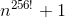

# The Complexity of Mio's "signature" algorithm (`Mio.sign`)

### Explanation

- 
  - __Get the sum from *n=16* to *n=36*__
  - `Mio.sign` returns its output using the numerical bases from No16 (0-9, a-f) to No36 (0-9, a-z)

- 
  - __Get the [permutations](https://en.wikipedia.org/wiki/Permutation) of _n256!___
    - Use *256!* since the signature can be any length of *(0, 256]* (see [intervals])
    - _The signature's length will only be **0** for an empty string_
  - `Mio.sign` will return a string with a length between *(0, 256]* (see [intervals])

- \+ 1
  - Include the empty string

[intervals]: https://en.wikipedia.org/wiki/Interval_(mathematics)
